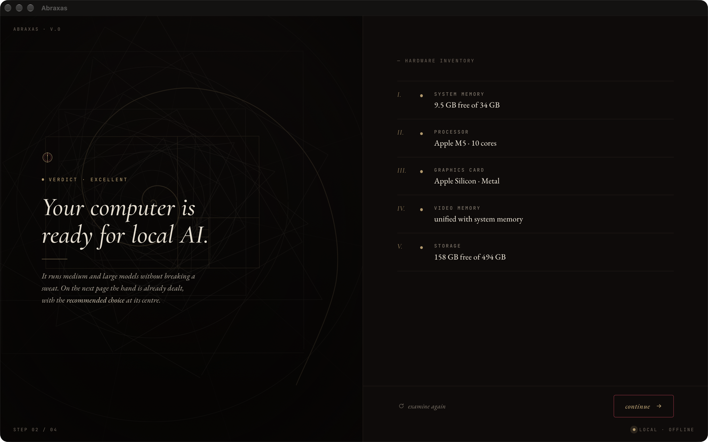
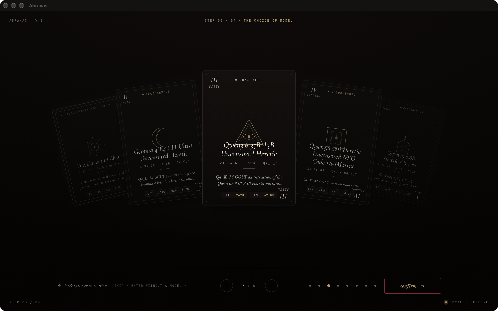
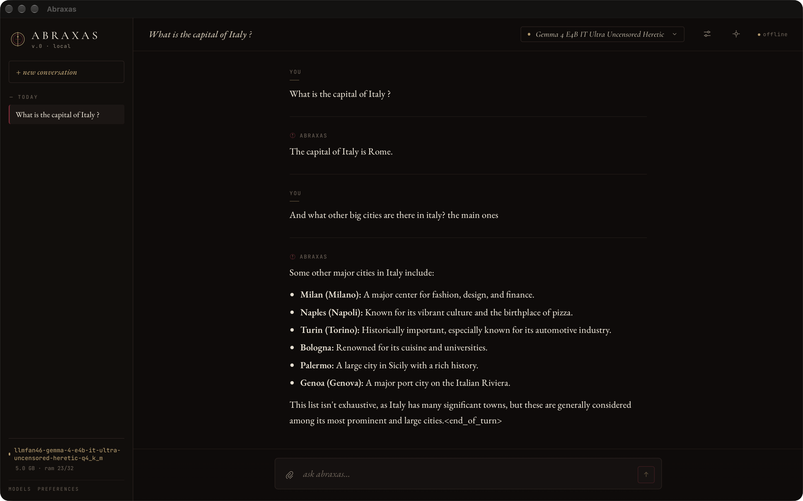
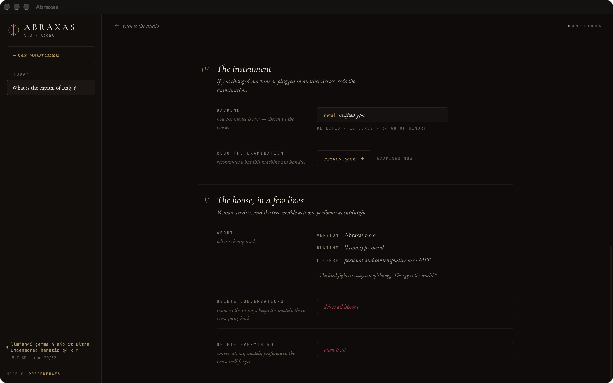

<div align="center">


# Abraxas

**Chat with open-source LLMs on your own machine. No cloud, no API keys, no telemetry.**

A cross-platform desktop app that downloads a model, picks the right GPU backend for
your hardware, and gets out of the way. Everything runs locally — the conversation
never leaves your computer.

[](https://github.com/ArthurAdrianoMM/Abraxas/actions/workflows/ci.yml)
[](https://github.com/ArthurAdrianoMM/Abraxas/releases/latest)
[](LICENSE)


<!-- TODO(assets): docs/assets/hero.gif — 10s loop, model already loaded,
     one prompt typed and the answer streaming in. This is the single most
     important image in the repo; it plays before anyone reads a word. -->


</div>

---

## Download

> **Beta.** The full path works end to end — install, hardware check, model download,
> conversation — but there are rough edges. Bug reports are welcome in
> [Issues](https://github.com/ArthurAdrianoMM/Abraxas/issues).

<div align="center">

[](https://github.com/ArthurAdrianoMM/Abraxas/releases/latest)&nbsp;&nbsp;[](https://github.com/ArthurAdrianoMM/Abraxas/releases/latest)&nbsp;&nbsp;[](https://github.com/ArthurAdrianoMM/Abraxas/releases/latest)

</div>

<details>
<summary><b>Your OS will warn you the developer is unknown — here's why, and how to get past it</b></summary>

<br>

The installers are not code-signed. A signing identity is a recurring annual cost
per platform that this personal project doesn't pay, so each OS shows a warning you
clear once:

- **Windows** — SmartScreen blue screen: *More info* → *Run anyway*. The installer
  runs per-user, so there's no UAC prompt stacked on top of it.
- **macOS** — the app is ad-hoc signed (which is what stops Gatekeeper from calling
  it *damaged*) but not notarized. First launch is blocked; clear it in
  *System Settings* → *Privacy & Security* → *Open Anyway*. On macOS 15+ the old
  right-click → *Open* shortcut no longer works.
- **Linux** — no warning at all. The AppImage just needs `chmod +x`.

Removing the warnings isn't a packaging trick — it requires a paid identity
(Apple Developer Program for notarization; an OV or Azure Trusted Signing
certificate for SmartScreen reputation).

</details>

---

## What it looks like

| | |
|---|---|
|  |  |
| **First run reads your machine** — CPU, cores, RAM, GPU — and picks an inference backend for you. | **The catalog rates every model against your hardware**, so you're never offered something that won't run. |
|  |  |
| **Tokens stream as they're generated**, with markdown rendering and a stop button. | **Conversations persist locally** in SQLite; generation parameters are per-conversation. |

### The 90-second walkthrough

Zero to first token: hardware check, model download, first answer streaming in.

<!-- The bare URL below is a GitHub attachment; GitHub's renderer turns it into
     an inline <video> player. It must stay bare and on its own line — wrapped in
     markdown link syntax it degrades to a plain link, and a <video> tag written
     by hand is stripped by the sanitizer.

     Anchored by: <ISSUE URL — see below>. GitHub does not document retention for
     user-attachments, and unlinked uploads are reported to be garbage-collected
     after ~30 days, so the asset is kept referenced from a submitted issue rather
     than from this README alone. Master copy: docs/assets/Video2F.mp4 (gitignored). -->

https://github.com/user-attachments/assets/d347b2b6-67db-409f-bc87-be21e1e42a50

---

## Why it exists

Running an LLM locally today means picking a quantization, knowing what a GGUF is,
matching a backend to your GPU, and often a terminal. Abraxas is the argument that
none of that should be the user's problem.

- **Private by design.** After the first download the app works offline. No account,
  no server, no telemetry — nothing to opt out of, because nothing is sent.
- **Zero configuration.** You are never asked to choose a backend, a quantization or
  a context size. The app detects the hardware and decides.
- **Uncensored models are first-class.** Abliterated and community fine-tunes sit in
  the catalog next to everything else. Your machine, your model.
- **One installer per OS.** All the relevant GPU backends are bundled; the right one
  is chosen at runtime.

## How it works

Hardware detection runs once at first launch and is cached against a hardware
fingerprint, so it re-runs only if the machine actually changes.

| Detected hardware | Backend | Why |
|---|---|---|
| Apple Silicon | **Metal** | Unified memory, ships with the OS |
| Windows + NVIDIA | **CUDA** | 10–15% faster than Vulkan on NVIDIA in llama.cpp |
| Linux + NVIDIA | **Vulkan** | CUDA runtime isn't shippable — [see below](#engineering-notes) |
| AMD / Intel GPU | **Vulkan** | One build covers both vendors |
| Anything else | **CPU** | Always works |

```
React + TypeScript  ──  typed commands  ──▶  Rust core
   (Vite, CSS Modules)   (tauri-specta)        │
                                               ├── hardware/   sysinfo · raw-cpuid · NVML · Vulkan enumeration
                                               ├── models/     catalog fetch · resumable download · SHA-256 verify
                                               ├── inference/  InferenceBackend trait ──▶ llama.cpp (llama-cpp-2)
                                               ├── chat/       chat templates · context window · sampling params
                                               └── db/         SQLite via sqlx, with migrations
```

Bindings are generated from the Rust commands, so a signature change breaks the
TypeScript build instead of failing at runtime — CI fails if the checked-in
bindings drift from what the Rust side would emit.

## Engineering notes

The interesting parts of this project were not the chat UI. A few of them, each
with the full write-up behind it:

**Static-linking every GPU backend doesn't scale.** Bundling CUDA and Vulkan into
one binary means every backend's dependencies must resolve at link time on every
machine. Abraxas loads ggml backends dynamically instead and picks at runtime —
which turned out to also make llama and ggml themselves shared libraries, the
larger half of the packaging problem.
→ [ADR 0001](docs/decisions/0001-dynamic-backend-loading.md)

**The Linux release ships without CUDA, on purpose.** `libggml-cuda.so` needs
`libcudart.so.12` and `libcublas.so.12` — a ~700 MB toolkit that no NVIDIA driver
installs. The target user doesn't have it, so the module would fail to `dlopen`
and fall through to Vulkan anyway. Packaging never even got that far: `linuxdeploy`
walks `DT_NEEDED` on every ELF in the AppDir and aborts on the first unresolved
one, which is how v0.1.5 shipped with zero Linux artifacts.
→ [ADR 0001 §5.5.1](docs/decisions/0001-dynamic-backend-loading.md)

**The Tauri bundler copies every `[[bin]]` and ignores `required-features`.** A dev
helper declared in the app crate is either dead weight in the installer (v0.1.0
shipped a 13 MB `export_bindings` inside `Abraxas.app`) or a hard build failure
(v0.1.1, which tried to gate them behind a feature). The fix was a separate
workspace member the bundler never sees — and a CI check asserting the app package
declares exactly one binary.

**The version lives in the git tag, not in four manifests.** `Cargo.toml` says
`0.0.0`; the release runner writes the real version in before the bundler reads it,
and commits nothing. `tauri.conf.json` omits `version` entirely so the bundler falls
back to Cargo. No bump commit to forget, no version guard to abort a tag.

**Backend selection is a pure function.** `select_backend(SystemInfo, GpuBackend)`
does no I/O, so every branch — including hardware the developer doesn't own — is
covered by unit tests that run on all three OSes in CI. 136 tests total.

## Stack

| Layer | Choice |
|---|---|
| Shell | Tauri v2 — ~15 MB bundle against Electron's ~150 MB |
| Core | Rust: `tokio`, `sqlx`, `reqwest`, `tracing`, `thiserror` |
| Inference | `llama-cpp-2` behind an `InferenceBackend` trait |
| Type safety | `tauri-specta` — TypeScript generated from Rust commands |
| Frontend | React 19 + TypeScript + Vite, CSS Modules, Zustand |
| i18n | Typed dictionaries, no runtime library — a missing key is a build error |
| CI/CD | GitHub Actions — 3 OSes, GPU builds, bundle smoke tests, tag-driven releases |

Electron with `node-llama-cpp` would have shipped sooner. Rust was chosen
deliberately, for the depth.

## Why "Abraxas"

Abraxas is a gnostic figure that holds opposites in one form — the name for a thing
that refuses to be split into the sanctioned half and the forbidden half. That is
the app's position on local models: no split, no arbiter, no remote judgment about
what you're allowed to ask.

The interface follows the metaphor rather than mentioning it. Models are *awakened*
rather than loaded, the catalog is a *compendium*, and wiping your data is called
what it is. It's a deliberate identity, not decoration.

## Status

Beta. Working today: hardware detection and backend selection, the remote model
catalog with per-machine compatibility ratings, resumable downloads with SHA-256
verification, model lifecycle management, streaming generation with cancellation,
SQLite-backed conversation history, settings, and a fully localised UI in
**English and Portuguese** (picked from the host locale on first run, switchable
in settings).

On the roadmap: auto-update, broader model coverage, and localised catalogue
descriptions — the model blurbs still come from the catalogue in one language.

## Contributing

Build instructions, the typed-bindings workflow and the release procedure are in
[CONTRIBUTING.md](CONTRIBUTING.md). Full project context — vision, stack rationale,
phased roadmap — is in [CLAUDE.md](CLAUDE.md).

## License

MIT — see [LICENSE](LICENSE).
